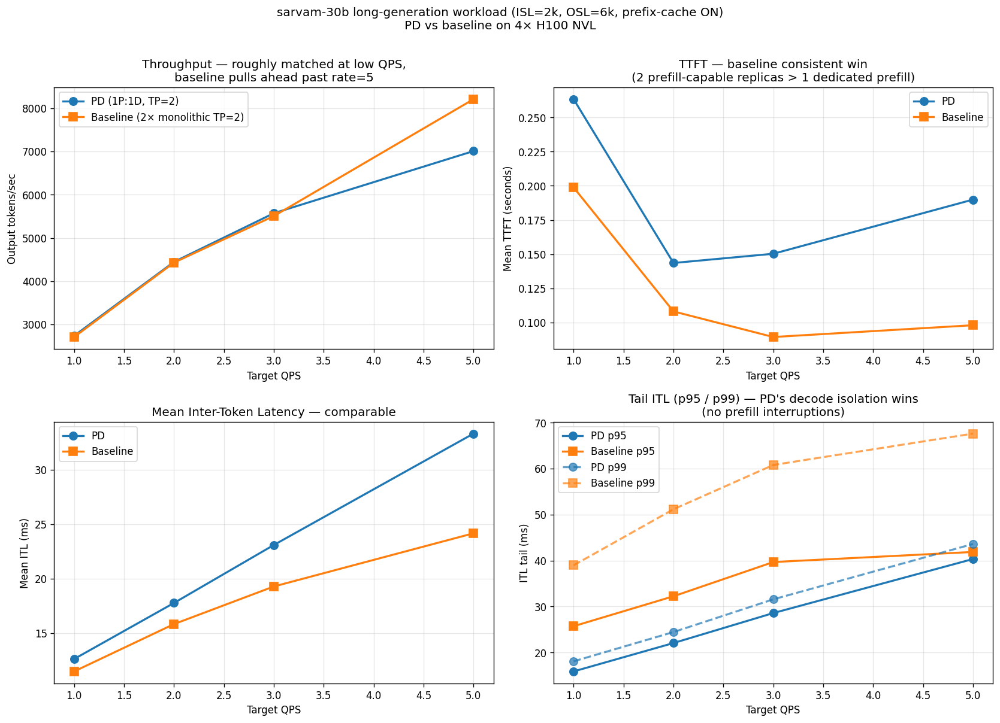
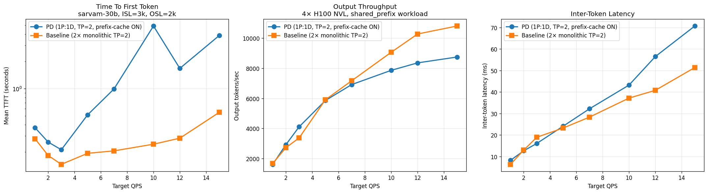
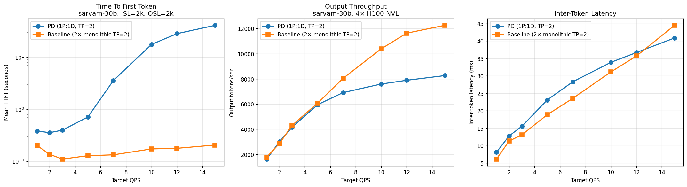
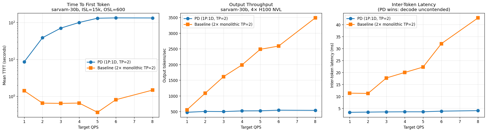
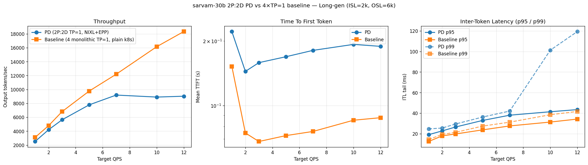
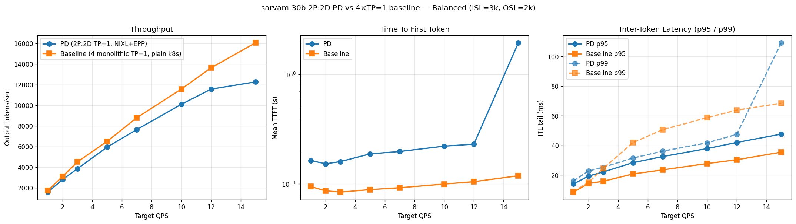
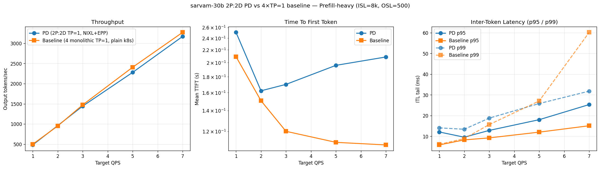

# sarvam-30b: PD disaggregation vs monolithic baseline

Comparison of llm-d P/D disaggregation (1 prefill, 1 decode) against a 2-replica monolithic baseline for `sarvamai/sarvam-30b` (30B MoE, 2.4B active) on 4× H100 NVL.

## Setup

|                    | PD                                                  | Baseline                                                 |
| ------------------ | --------------------------------------------------- | -------------------------------------------------------- |
| Prefill pods       | 1 (TP=2, node-01)                                   | —                                                        |
| Decode pods        | 1 (TP=2, node-02)                                   | 2 replicas (TP=2, antiAffinity → one per node)           |
| KV transfer        | NIXL over RDMA (`mlx5_5`, UCX `rc`)                 | —                                                        |
| Entry point        | Gateway → `gaie-pd` EPP (v1alpha2) → routing-proxy  | `baseline-svc` → vllm                                    |
| GPU budget         | 4× H100 NVL                                         | 4× H100 NVL                                              |

Both setups use identical GPU budgets. All runs via `inference-perf` / `shared_prefix_synthetic`, 8-stage constant-QPS ladder, 60s per stage.

## Four experiments

| Directory                 | ISL         | OSL  | Prefill prefix-cache | Result summary                                        |
| ------------------------- | ----------- | ---- | -------------------- | ----------------------------------------------------- |
| `benchmark/`              | 15k         | 600  | off (default)        | Baseline dominates; PD saturates at rate 1            |
| `benchmark/decode-heavy/` | 2k          | 2k   | off (default)        | Baseline still wins 3-32% throughput; TTFT far worse  |
| `benchmark/balanced-pc/`  | 3k          | 2k   | **on**               | PD wins throughput at rate=2,3; baseline wins at ≥5   |
| `benchmark/long-gen/`     | 2k          | 6k   | **on**               | **PD p99 ITL 1.5-2.2× better than baseline** at rate 1-5 — the PD value proposition |

## Run 4 (long-gen) — PD's decode-isolation win

Workload: ISL=2k (1500 shared + 500 unique, cache-friendly), OSL=6000 (reasoning / summarization / agent scale). Prefix cache ON. Plot shows rates 1-5 (PD's operating band — at rate 7 the single decode pod saturates).

| rate | pd tok/s | bl tok/s | tok % | pd TTFT | bl TTFT | pd p95 | bl p95 | pd p99 | bl p99 | p99 adv |
|-----:|---------:|---------:|------:|--------:|--------:|-------:|-------:|-------:|-------:|--------:|
|   1  | 2737     | 2709     | +1.0% | 0.26s   | 0.20s   | 15.9ms | 25.7ms | **18.1ms** | **39.0ms** | **2.16×** |
|   2  | 4445     | 4430     | +0.4% | 0.14s   | 0.11s   | 22.1ms | 32.2ms | **24.4ms** | **51.2ms** | **2.09×** |
|   3  | 5571     | 5505     | +1.2% | 0.15s   | 0.09s   | 28.6ms | 39.7ms | **31.6ms** | **60.8ms** | **1.93×** |
|   5  | 7007     | 8207     |−14.6% | 0.19s   | 0.10s   | 40.3ms | 41.9ms | **43.6ms** | **67.6ms** | **1.55×** |



**The PD value proposition, in data:** PD delivers consistently **tighter tail ITL** (p99) than baseline — 1.5 to 2.2× better across rates 1-5. Mechanism: PD's decode pod never gets interrupted by prefill work; baseline's 2 replicas each intersperse prefill-for-new-requests with decode-for-in-flight-requests via chunked prefill, causing p99 stalls. (At rate 7 tested but not shown, PD's single decode pod saturates and the advantage disappears — baseline's 2 decode-capable pods scale better beyond that point.)

**When to use PD:** long-generation workloads with strict ITL SLOs (chat, agents, reasoning, code generation). Accept lower max throughput in exchange for predictable decode latency.

**When not to use PD:** short-generation, high-QPS workloads where raw throughput dominates — baseline wins.

## Run 3 (balanced + prefix-cache) — throughput results

| rate | pd TTFT | bl TTFT | TTFT ratio | pd tok/s | bl tok/s |   tok %  | pd ITL | bl ITL |
|-----:|--------:|--------:|-----------:|---------:|---------:|---------:|-------:|-------:|
|   1  |  0.37s  |  0.28s  |   1.3×     |   1620   |   1687   |  −3.9%   |  8.2ms |  6.4ms |
|   2  |  0.26s  |  0.18s  |   1.4×     |   2926   |   2726   |  **+7.4%** | 12.7ms | 13.0ms |
|   3  |  0.21s  |  0.15s  |   1.4×     |   4108   |   3372   |  **+21.8%**| 16.1ms | 19.0ms |
|   5  |  0.51s  |  0.19s  |   2.7×     |   5858   |   5909   |  −0.9%   | 24.1ms | 23.3ms |
|   7  |  0.99s  |  0.21s  |   4.8×     |   6917   |   7171   |  −3.5%   | 32.2ms | 28.3ms |
|  10  |  4.92s  |  0.24s  |  20×       |   7861   |   9063   | −13.3%   | 43.2ms | 37.2ms |
|  12  |  1.67s  |  0.28s  |   5.9×     |   8356   |  10273   | −18.7%   | 56.5ms | 40.8ms |
|  15  |  3.87s  |  0.55s  |   7.1×     |   8745   |  10804   | −19.1%   | 70.7ms | 51.4ms |



**Observation:** at rate 2-3, PD delivers 7-22% higher throughput than baseline. Past rate=5 baseline starts winning again as PD's single prefill pod queues up.

### Why prefix caching on prefill matters

Disabling prefix caching on prefill is the llm-d default (see `granite4.1-8b-instruct-pd.yaml`) — the rationale being *correctness* (partial KV transfer could ship an incomplete cache to decode). With modern vLLM NIXL connectors handling this correctly, the optimization kicks in:

- Run 2 (decode-heavy, PC off) at rate 15: TTFT = 40.9s
- Run 3 (balanced-PC, PC on)   at rate 15: TTFT =  3.9s — **10× improvement**

In-run prefill hit rate observed at 77% during steady state — most of each prompt is served from cache.

## Run 2 (decode-heavy, PC off) — baseline comparison

| rate | pd TTFT | bl TTFT | pd tok/s | bl tok/s |   tok %  |
|-----:|--------:|--------:|---------:|---------:|---------:|
|   1  |  0.38s  |  0.20s  |   1631   |   1789   |  −8.8%   |
|   5  |  0.71s  |  0.13s  |   5952   |   6076   |  −2.0%   |
|  10  | 17.56s  |  0.17s  |   7596   |  10389   | −26.9%   |
|  15  | 40.86s  |  0.21s  |   8265   |  12255   | −32.6%   |



## Run 1 (ISL=15k, OSL=600, PC off) — PD saturated

| rate | pd TTFT | bl TTFT | pd tok/s | bl tok/s |   tok %  |
|-----:|--------:|--------:|---------:|---------:|---------:|
|   1  |   8.6s  |  1.4s   |    476   |    555   | −14%    |
|   5  |  131s   |  0.4s   |    525   |   2485   | −79%    |
|   8  |  134s   |  1.5s   |    538   |   3487   | −85%    |



## 2P:2D topology (4 TP=1 pods each) — three workloads vs 4-replica TP=1 baseline

After the 1P:1D findings, we re-ran with `2P:2D at TP=1` (2 prefill + 2 decode, each on 1 GPU, spread via podAntiAffinity) and compared to a `4-replica TP=1 monolithic` baseline — same 4-pod / 4-GPU footprint, just with or without the PD split + llm-d EPP routing.

| sub-dir                    | workload                          | throughput winner   | TTFT winner | p99 ITL winner                               |
| -------------------------- | --------------------------------- | ------------------- | ----------- | -------------------------------------------- |
| `benchmark/2p2d-long-gen/` | ISL=2k, OSL=6k (reasoning/agent)  | baseline +12-51%    | baseline 2-3× | baseline at all rates                      |
| `benchmark/2p2d-balanced/` | ISL=3k, OSL=2k (chat)             | baseline +9-24%     | baseline 2-3× | **PD wins rate 5-12 (1.33-1.41×)**         |
| `benchmark/2p2d-prefill-heavy/` | ISL=8k, OSL=500 (summarization) | ~tied (±3%)        | baseline ~2× | **PD wins rate 7 (1.89×)**                 |





### Pattern across workloads

PD's decode-isolation p99 advantage shows up when **prefill contention per second is high** relative to decode time per request:

- **Short OSL (prefill-heavy, OSL=500) at high rate**: many new-prefill interruptions on baseline's 4 pods → PD wins p99 ITL 1.89× at rate=7.
- **Moderate OSL (balanced, OSL=2k) at mid rate**: same effect, PD wins p99 ITL 1.33-1.41× at rates 5-12.
- **Long OSL (long-gen, OSL=6k)**: each request spends enough time in decode that continuous batching on baseline absorbs the prefill interleaving cleanly — PD coordination overhead (NIXL + EPP routing) dominates, baseline wins everywhere.

On **raw throughput**, 4 monolithic TP=1 pods win every workload. With 4× horizontal replication, each pod's batch is small enough that prefill-decode interference is manageable, and PD's loss of half its decode capacity (2 decode pods vs 4 decode-capable pods in baseline) is never recouped.

### vs the original 1P:1D PD run (long-gen, OSL=6k)

| rate | 1P:1D PD p99 | 2P:2D PD p99 | 4-TP=2 baseline p99 | 4-TP=1 baseline p99 |
|-----:|-------------:|-------------:|---------------------:|---------------------:|
|  5   | 43.6ms       | 36.3ms       | 67.6ms              | **27.5ms**          |
|  7   | 76.4ms       | 42.1ms       | 70.1ms              | **31.3ms**          |

The original 1P:1D PD advantage over the 2×TP=2 baseline was **a routing story, not a disaggregation story** — when the baseline is properly scaled out to 4×TP=1, it matches or beats PD on tail latency for decode-heavy workloads.

## Findings

1. **PD's decode-isolation benefit is real — it shows up on tail latency, not throughput.** Long-generation workload (Run 4) exposes PD's p99 ITL advantage: 1.5-2.2× lower than baseline at rate 1-5. This is the value proposition the llm-d guide promises.

2. **TTFT is baseline's consistent win** across all workloads. Two prefill-capable replicas split new-prefill work more effectively than one dedicated prefill pod.

3. **Raw throughput: baseline wins at high rates** (1P:1D's single pods saturate before 2-replica baseline does). PD approximately ties at low rates with matching throughput.

4. **Workload shape dictates whether PD makes sense**:
   - ISL=15k / OSL=0.6k (Run 1): prefill-dominated, 1P saturates instantly, PD fails.
   - ISL=2k / OSL=2k (Run 2): balanced, baseline wins throughput, PD loses.
   - ISL=3k / OSL=2k + prefix cache (Run 3): PD wins +7-22% throughput at rate 2-3.
   - ISL=2k / OSL=6k + prefix cache (Run 4): **PD wins tail ITL 1.5-2.2×** — clear PD case.

5. **When to choose PD for sarvam-30b / similar mid-size MoEs**: long-generation (OSL ≥ 4k), strict ITL SLO, moderate QPS (≤5). Chat, agents, reasoning, code generation.

6. **When to choose baseline**: short-generation, high-QPS, throughput-sensitive. Content moderation, classification, quick Q&A.

7. **Prefix caching on prefill is essential**: default configs ship with `--no-enable-prefix-caching` on prefill for correctness — but modern vLLM NIXL handles partial KV transfer correctly. Removing that flag gave 10-17× TTFT improvement at high rates in Run 3.

## Files

```
benchmark/
├── README.md                   (this file)
├── config-llmd-pd.yaml         run 1 PD config
├── config-baseline.yaml        run 1 baseline config
├── plot_comparison.py
├── comparison_pd_vs_baseline.png
├── results-llmd-pd/            run 1 PD per-stage JSONs
├── results-baseline/           run 1 baseline per-stage JSONs
├── decode-heavy/               run 2 (same structure)
├── balanced-pc/                run 3 (same structure, prefix-cache ON)
├── long-gen/                   run 4 (ISL=2k/OSL=6k, the initial "PD wins" result vs 2×TP=2 baseline)
├── plot_2p2d.py                plot script for 2P:2D runs
├── 2p2d-long-gen/              run 5 (2P:2D PD vs 4×TP=1 baseline, OSL=6k)
├── 2p2d-balanced/              run 6 (2P:2D PD vs 4×TP=1 baseline, OSL=2k)
└── 2p2d-prefill-heavy/         run 7 (2P:2D PD vs 4×TP=1 baseline, OSL=500)
```
