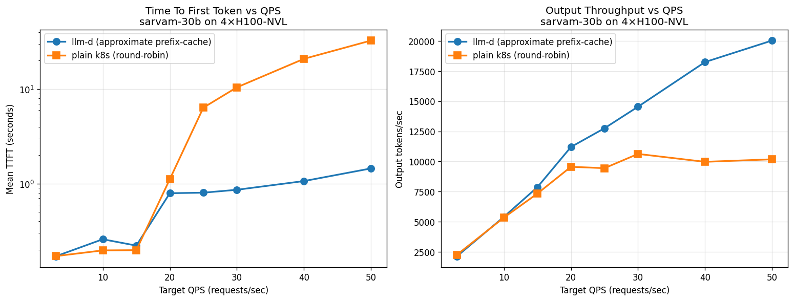
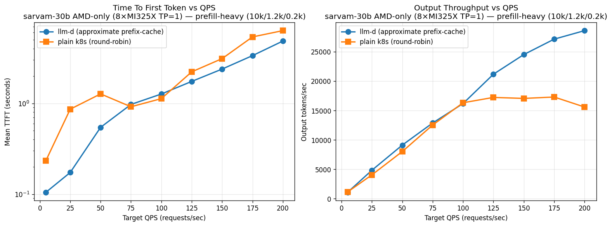
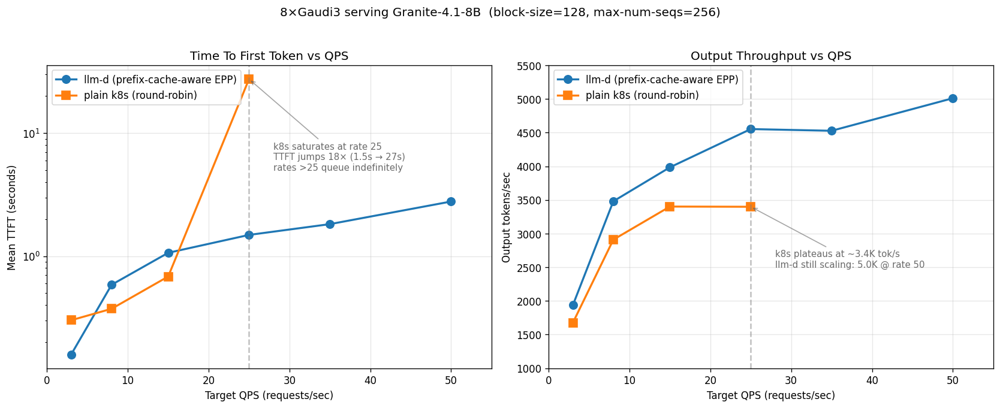

# NVIDIA - 4 GPUs (Prefix-caching)
## Granite-8b  ✅ 

**Highlight :  llm-d improves TTFT by upto 16x compared to K8s, and throughput (Output tok/s) by 25-36%**

## Sarvam-30b ✅ 

**Highlight: llm-d delivers 2× the throughput and 22× better TTFT. k8s saturates around rate=25-30; llm-d keeps scaling**

# AMD - 8 GPUs (Prefix-caching)
## Granite-8b ✅ 
Not yet finalized. We are trying decode-heavy workloads since AMD has larger memory, and is optimized for decode.

## Sarvam-30b

**Highlight: While K8s throughput plateaus at 15-17 K tok/s, llm-d goes upto 29K tok/s, 85% higher throughput. TTFT-wise llm-d upto  5x faster for lower rates**

# Gaudi - 8 GPUs (Prefix-caching)

## Granite-8b ✅ 

**At saturation (rate 25), llm-d delivers +34% throughput AND ~18× better TTFT vs plain k8s round-robin**
# NVIDIA + AMD - 12 GPUs (Prefix-caching)

## Granite-8b ✅ 

**Highlight: While K8s throughput plateaus at 10-11 K tok/s, llm-d goes upto 19.4K tok/s, 85% higher throughput. TTFT-wise llm-d does 3.4-5.6x faster for higher rates**

## Sarvam-30b 

**llm-d brings down TTFT by 2.85-4.54× , increases throughput by close to 3x at rate=200.
llm-d wins biggest in the mixed pool — round-robin is most punished by heterogeneous capacity (slow NVIDIA pods drag k8s peak down to 10K), and llm-d's prefix-aware routing avoids this trap.**

# NVIDIA + AMD + Gaudi

## Granite-8b ✅ 
Not yet finalized.

# NVIDIA - 4 GPUs (PD Disaggregation)
## Sarvam-30b 

**Highlight: PD reduces tail (inter-token) latency by up to 89%, while closely matching the throughput. PD's ideally works bestfor serving larger models 120b+, hence we do not see throughput gains**
