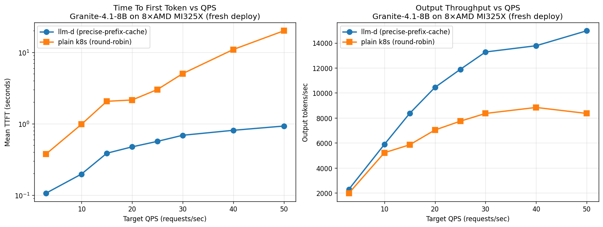
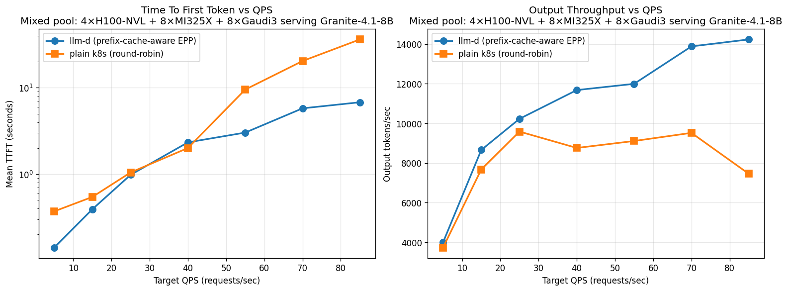

# Summary

Across every pool we tested — single-vendor (NVIDIA-only / AMD-only / Gaudi-only) and heterogeneous (NVIDIA+AMD, NVIDIA+AMD+Gaudi) — **llm-d's prefix-cache-aware EPP routing consistently wins over plain k8s** on both throughput and TTFT. The advantage grows with pool size and heterogeneity:

| Pool | Pods | Model | Throughput edge | TTFT edge |
|---|---|---|---|---|
| NVIDIA-only | 4 H100-NVL | granite-4.1-8b | +25–36% | 16× |
| NVIDIA-only | 4 H100-NVL | sarvam-30b | 2× | 22× |
| AMD-only | 8 MI325X | granite-4.1-8b | +79% | 21× |
| AMD-only | 8 MI325X | sarvam-30b | +85% (29K vs 17K) | 5× |
| Gaudi-only | 8 Gaudi3 | granite-4.1-8b | +34% | 18× |
| NVIDIA + AMD | 12 | granite-4.1-8b | +85% (19.4K vs 10–11K) | 3.4–5.6× |
| NVIDIA + AMD | 12 | sarvam-30b | ~3× @ rate 200 | 2.85–4.54× |
| NVIDIA + AMD + Gaudi | 20 | granite-4.1-8b | **+91% @ rate 85** | **5.4×** |

**Why llm-d wins biggest on heterogeneous pools:** k8s round-robin spreads requests evenly regardless of pod speed, so a single slow vendor (an underpowered NVIDIA tier among MI325X, or un-tuned Gaudi) becomes a queueing sink that drags total throughput down. llm-d's prefix-cache-aware EPP routes around saturated pods and concentrates cache hits on warm ones, so heterogeneity is no longer a penalty.

---

# NVIDIA - 4 GPUs (Prefix-caching)
## Granite-8b  ✅ 

**Highlight :  llm-d improves TTFT by upto 16x compared to K8s, and throughput (Output tok/s) by 25-36%**

## Sarvam-30b ✅ 

**Highlight: llm-d delivers 2× the throughput and 22× better TTFT. k8s saturates around rate=25-30; llm-d keeps scaling**

# AMD - 8 GPUs (Prefix-caching)
## Granite-8b ✅ 

**llm-d delivers up to 21× better TTFT and +79% throughput vs plain k8s round-robin on this AMD-only granite deployment**
## Sarvam-30b

**Highlight: While K8s throughput plateaus at 15-17 K tok/s, llm-d goes upto 29K tok/s, 85% higher throughput. TTFT-wise llm-d upto  5x faster for lower rates**

# Gaudi - 8 GPUs (Prefix-caching)

## Granite-8b ✅ 

**At saturation (rate 25), llm-d delivers +34% throughput AND ~18× better TTFT vs plain k8s round-robin**
# NVIDIA + AMD - 12 GPUs (Prefix-caching)

## Granite-8b ✅ 

**Highlight: While K8s throughput plateaus at 10-11 K tok/s, llm-d goes upto 19.4K tok/s, 85% higher throughput. TTFT-wise llm-d does 3.4-5.6x faster for higher rates**

## Sarvam-30b 

**llm-d brings down TTFT by 2.85-4.54× , increases throughput by close to 3x at rate=200.
llm-d wins biggest in the mixed pool — round-robin is most punished by heterogeneous capacity (slow NVIDIA pods drag k8s peak down to 10K), and llm-d's prefix-aware routing avoids this trap.**

# NVIDIA + AMD + Gaudi - 20 GPUs (Prefix-caching)

## Granite-8b ✅

**Highlight: The 20-pod 3-vendor pool delivers 14.2K out tok/s peak with llm-d vs 9.6K with k8s round-robin. k8s saturates at rate 25 and *declines* to 7.5K at rate 85 (queue depth dominates) — llm-d delivers +91% throughput at the same load. TTFT at rate 85: llm-d 6.8s, k8s 36.4s (5.4× better).**

<!-- ### Original (un-tuned Gaudi) for reference

# NVIDIA - 4 GPUs (PD Disaggregation)
## Sarvam-30b 

**Highlight: PD reduces tail (inter-token) latency by up to 89%, while closely matching the throughput. PD's ideally works bestfor serving larger models 120b+, hence we do not see throughput gains** -->
