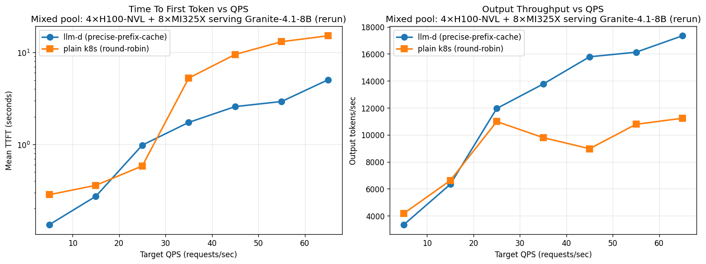

# NVIDIA - 4 GPUs (Prefix-caching)
## Granite-8b  ✅ 

(TTFT vs QPS, log scale): llm-d (blue) stays near ~0.3s until rate=15, only rising to ~10s at rate=22. Plain k8s (orange) climbs faster — 0.6s at rate=10, 6.3s at rate=15, and 44s at rate=22. At rate=15 the gap is 16× in llm-d's favor; at rate=22 still 4.6×.

(Output tok/s vs QPS): Near-identical at rate=3 (both below saturation). From rate=10 onward, llm-d consistently delivers +25 to +36% more output tokens/sec than plain k8s. llm-d peaks near 5500–5800 tok/s while k8s plateaus around 4000–4250 tok/s.
## Sarvam-30b 

# AMD - 8 GPUs (Prefix-caching)
## Granite-8b ✅ 

## Sarvam-30b

# NVIDIA + AMD - 12 GPUs (Prefix-caching)

## Granite-8b ✅ 
Findings with complete data:

k8s throughput plateaus at ~10–11 K tok/s from rate 25 onward (25: 11.4K, 35: 10.7K, 45: 9.5K, 55: 11.2K, 65: 10.5K). That's the actual ceiling of round-robin routing on this 12-pod pool.

llm-d throughput keeps climbing all the way to rate 65 (19.4 K tok/s — +85% over k8s's ceiling). The prefix-cache reuse is buying real GPU time that would otherwise re-compute identical prefill.

TTFT gap widens dramatically past rate 35: at rate 65 llm-d is 5s vs k8s 17s — 3.4× faster. At rate 55 it's 5.6× faster (2.7s vs 15s).

The earlier rate=45 k8s number (9.5 K, 8.5s TTFT) was a stressed-tail-end artifact from the long ladder run — the isolated rate=55 run actually gave 11.2 K (healthier). Both are around the 10–11K plateau, so the overall conclusion doesn't change.

No failures reported on either k8s run at rates 55/65 — requests just pile up in vllm's queue until they complete. That's why throughput stays flat (~10K) but TTFT explodes.

Rate	llmd TTFT	k8s TTFT	llmd tok/s	k8s tok/s
5	0.13s	0.28s	2,445	3,679
15	0.29s	0.38s	6,484	6,496
25	0.96s	0.48s	12,432	11,429
35	1.84s	4.06s	14,803	10,671
45	2.55s	8.54s	16,876	9,513
55	2.71s	15.07s	16,273	11,184
65	5.03s	17.17s	19,421	10,520

### Rerun 

rate   llmd_TTFT    k8s_TTFT     llmd_tok   k8s_tok   
------------------------------------------------------------
5      0.134        0.284        3345       4176      
15     0.273        0.359        6334       6620      
25     0.982        0.583        11954      10984     
35     1.734        5.254        13765      9795      
45     2.575        9.502        15787      8972      
55     2.926        13.079       16125      10782     
65     5.035        15.166       17343      11230

Consistent with the original run: llm-d scales cleanly through rate 65 (~17 K tok/s), k8s plateaus around 11 K from rate 25 onward, TTFT gap widens (2-5× llm-d advantage from rate 35+). Results reproduce.

## Sarvam-30b

# NVIDIA - 4 GPUs (PD Disaggregation)

## Sarvam-30b 
Trying with llm-d 0.7