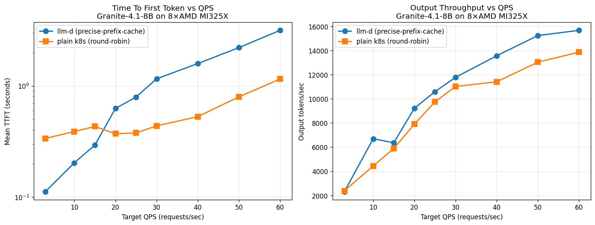
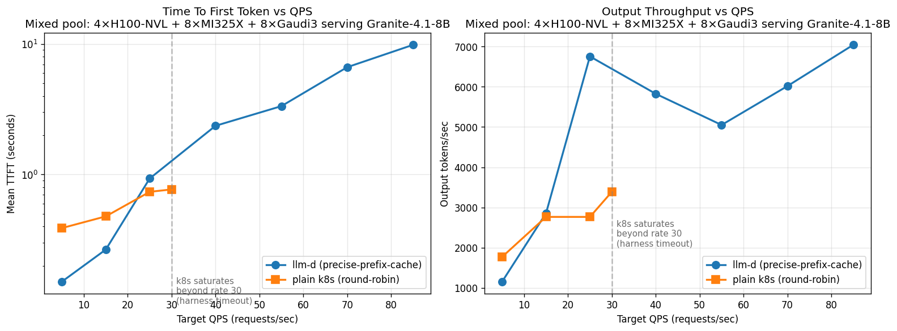
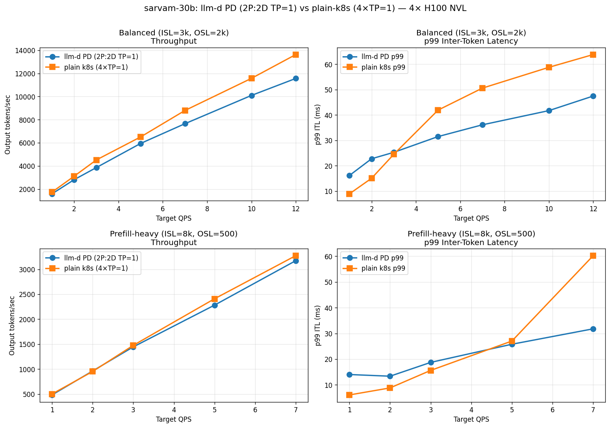

# NVIDIA - 4 GPUs (Prefix-caching)
## Granite-8b  ✅ 

**Highlight :  llm-d improves TTFT by upto 16x compared to K8s, and throughput (Output tok/s) by 25-36%**

## Sarvam-30b 

# AMD - 8 GPUs (Prefix-caching)
## Granite-8b ✅ 
Not yet finalized. We are trying decode-heavy workloads since AMD has larger memory, and is optimized for decode.

## Sarvam-30b

# NVIDIA + AMD - 12 GPUs (Prefix-caching)

## Granite-8b ✅ 

**Highlight: While K8s throughput plateaus at 10-11 K tok/s, llm-d goes upto 19.4K tok/s, 85% higher throughput. TTFT-wise llm-d does 3.4-5.6x faster for higher rates**
## Sarvam-30b

# NVIDIA + AMD + Gaudi

## Granite-8b ✅ 
Not yet finalized.

# NVIDIA - 4 GPUs (PD Disaggregation)
## Sarvam-30b 

**Highlight: PD reduces tail (inter-token) latency by up to 89%, while closely matching the throughput **