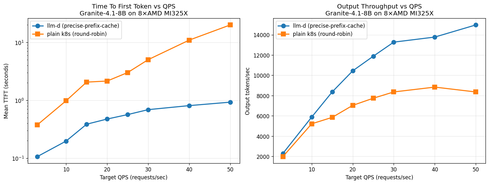
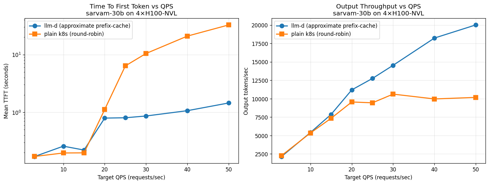
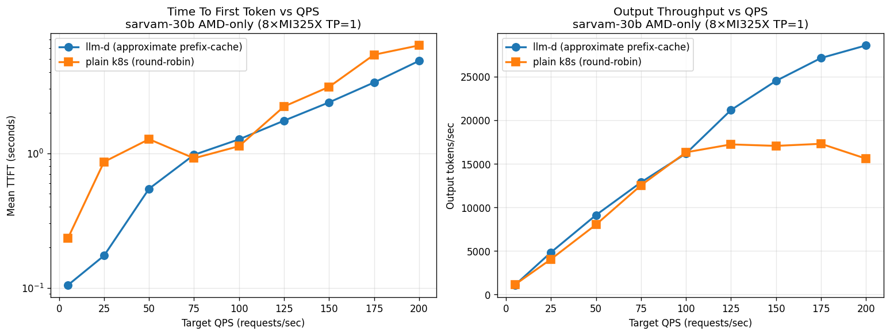
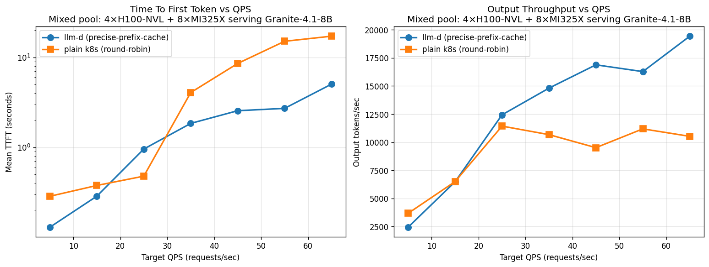
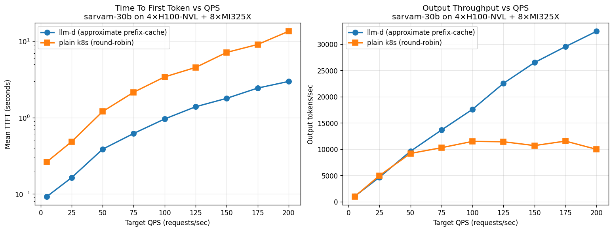
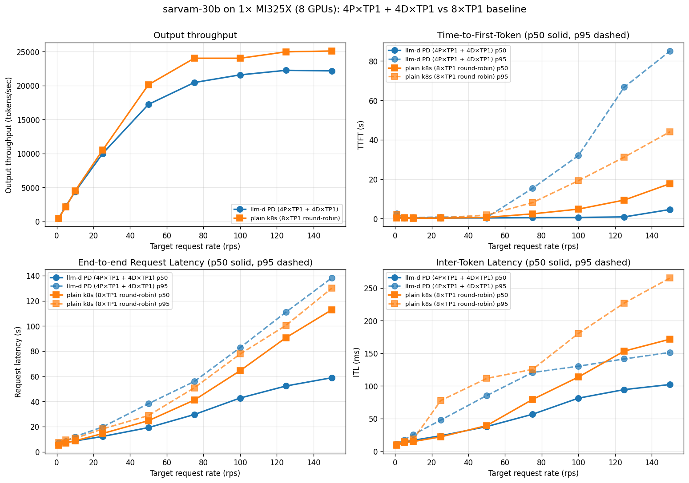

# Inside llm-d: Heterogeneous Inference at Scale on a 3-Vendor Sovereign Cluster

*A technical deep-dive on how llm-d's prefix-cache-aware routing delivered +91% throughput and 5.4× better TTFT vs plain Kubernetes round-robin on a 20-GPU pool spanning NVIDIA H100, AMD MI325X, and Intel Gaudi3 on NxtGen's sovereign cloud — including where it doesn't help, and what we tuned along the way.*

A joint proof-of-concept by IBM Research, Red Hat, and NxtGen Cloud Technologies.

## Why heterogeneous inference is hard

Production inference clusters are rarely homogeneous. They span NVIDIA, AMD, Intel, and other accelerator vendors, plus multiple hardware generations acquired across procurement cycles. Treating that heterogeneity as a first-class advantage rather than an operational liability unlocks real value — but realizing it is non-trivial.

Standing up a multi-accelerator cluster requires reconciling divergent driver stacks, firmware versions, and container runtimes. High-performance inference depends critically on the interconnect fabric: NVLink, RoCE, and InfiniBand differ in topology, MTU, and RDMA semantics, and misconfigured networking manifests as unpredictable latency spikes rather than clean failures. Layered on top are hardware-specific attention kernels, divergent compiler backends, and the absence of standardized performance contracts across accelerators — all of which make a coherent serving layer over a heterogeneous fleet a hard systems problem.

This is the gap **vLLM and llm-d together address**: vLLM as a high-performance inference engine with broad accelerator support, and llm-d as the Kubernetes-native distributed serving layer that brings disaggregated prefill/decode scheduling and intelligent request routing to heterogeneous clusters.

## llm-d in one minute

llm-d is an open-source, Kubernetes-native distributed LLM inference framework, recently accepted as a CNCF Sandbox project. Rather than replacing the inference engine, llm-d sits above it as an intelligent control plane — integrating with vLLM as the serving backend and extending Kubernetes with inference-aware scheduling and routing through its **Inference Gateway** component.

Three capabilities matter for this post:

1. **Prefix-Cache-Aware Scheduling** — the scheduler tracks the KV cache state of every vLLM instance in real time (reading KV events directly from vLLM) and routes each incoming request to the instance most likely to already hold the matching prefix. The scheduler is indifferent to whether the best-matched instance runs on an H100, MI325X, or Gaudi3.
2. **Prefill/Decode (P/D) Disaggregation** — separates the compute-bound prefill phase from the memory-bandwidth-bound decode phase onto dedicated pools and transfers the KV cache between them over the network. (Covered in *Future Work* — not the focus of this post.)
3. **Hardware-Agnostic Operation** — single API endpoint regardless of which accelerator serves the request.

## Cluster setup

We ran on **NxtGen's sovereign cloud**, with three accelerator pools available within a single OpenShift AI cluster:

| Pool | Hardware | Count |
| --- | --- | --- |
| NVIDIA | H100-NVL (2 nodes × 2 GPUs) | 4 |
| AMD | MI325X (1 node) | 8 |
| Intel | Gaudi3 (1 node) | 8 |

All nodes share a **100 G RoCE** network. We pinned each vLLM replica to a single accelerator card (TP = 1) to maximize the number of independent serving instances and exercise the routing layer.

Models served: `ibm-granite/granite-4.1-8b` (8 B param hybrid-Mamba transformer) and `sarvamai/sarvam-30b` (30 B MoE Indic-multilingual model with custom vLLM kernels).

Container images:

- NVIDIA: `ghcr.io/llm-d/llm-d-cuda:v0.7.0-rc.4`
- AMD: `ghcr.io/llm-d/llm-d-rocm:v0.7.0`
- Gaudi: `ghcr.io/llm-d/llm-d-hpu:v0.7.0`

llm-d itself is upstream **v0.0.7**, deployed via the helm charts in the well-lit path with the **precise-prefix-cache-aware** EPP configuration ([guide](https://github.com/llm-d/llm-d/tree/main/guides/precise-prefix-cache-aware)).

### Deploying the multi-vendor stack

The full stack lives at [`prefix-cache-3vendor/mixed-3vendor-granite/`](https://github.com/praveingk/llmd-benchmarking-nxtgen/tree/main/prefix-cache-3vendor/mixed-3vendor-granite). At the top level we orchestrate everything with a single helmfile that produces five Helm releases in one Kubernetes namespace (`llm-d-granite-mixed-kv`):

| Release | Chart | What it deploys |
| --- | --- | --- |
| `infra-granite-mixed` | `llm-d-infra/llm-d-infra` | `Gateway` + supporting infra |
| `gaie-granite-mixed` | `gateway-api-inference-extension/inferencepool` | `InferencePool` + GAIE EPP |
| `ms-granite-mixed-nvidia` | `llm-d-modelservice/llm-d-modelservice` | 4 vLLM decode pods on H100-NVL |
| `ms-granite-mixed-amd` | `llm-d-modelservice/llm-d-modelservice` | 8 vLLM decode pods on MI325X |
| `ms-granite-mixed-gaudi` | `llm-d-modelservice/llm-d-modelservice` | 8 vLLM decode pods on Gaudi3 |

A separate `helm install` lays down a **standalone EPP** release (`precise-granite-mixed-epp`) using the upstream `gateway-api-inference-extension/standalone` chart, plus a small `httproute.yaml` we apply directly with `kubectl`.

#### One namespace, one InferencePool, three vendor pods

The trick that makes this work cleanly is that **all three `ms-*` releases write the same set of selector labels onto their pods**:

```yaml
labels:
  llm-d.ai/inference-serving: "true"
  llm-d.ai/guide: precise-prefix-cache-aware
  llm-d.ai/role: decode
```

The `InferencePool` (defined once in `httproute.yaml`) selects on those labels — it doesn't care about the vendor. Adding or removing a vendor's pods is just a matter of installing or uninstalling that vendor's `ms-*` Helm release; the EPP picks up the new endpoints automatically and starts routing across them.

Each per-vendor `values.yaml` varies only the bits that have to vary — the chart's `accelerator.type` field (`nvidia` / `amd` / `intel-gaudi` — the chart maps that to the right resource request automatically), the vLLM container image, the `nodeSelector`, and any vendor-specific tuning flags (e.g. Gaudi's `--block-size 128`, `--max-num-seqs 256`, `VLLM_BUILD` pin). One model, one workload-shaped values block per pool.

#### Phased rollout: AMD as an opt-in

When we built this, the AMD nodes were not yet available in the cluster. Rather than carry two copies of the helmfile or manually maintain a "phase-1" branch, we gated the AMD release on an env var inside the helmfile template:

```gotmpl
- name: ms-granite-mixed-amd
  installed: {{ env "DEPLOY_AMD" | default "false" }}
  ...
```

`./deploy.sh deploy` (Phase 1) brings up infra + gaie + NVIDIA + Gaudi only. Once the MI325X node was scheduled to us, `./deploy.sh deploy-amd` re-applies just the AMD release with `DEPLOY_AMD=true`. No edits, no drift between deployed and source — and because the EPP already routes by label selector, the AMD pods slot into the live pool with no other configuration changes.

#### Two EPPs, one routing decision

There's a subtlety here worth calling out. The `gaie-granite-mixed` release brings up the InferencePool's *built-in* GAIE EPP, which is what the `Gateway` ↔ `HTTPRoute` ↔ `InferencePool` Gateway-API path expects. But the precise-prefix-cache-aware scoring logic — the part that actually makes routing decisions based on KV-cache state — lives in the *standalone* `llm-d-inference-scheduler` EPP (`precise-granite-mixed-epp`). We deploy both: the `gaie-*` EPP as the Gateway's `extensionRef` target, the standalone EPP as the brain. The benchmark client and our `./deploy.sh test` hits the standalone EPP directly via its 8081 port; production traffic can go through the Gateway.

The standalone EPP runs the **approximate** `prefix-cache-scorer` (xxhash-based) rather than the *precise* one. The reason is pragmatic: the upstream `llm-d-inference-scheduler:v0.8.0` image is built without `embedded_tokenizers`, so the precise scorer (which needs a real HF tokenizer in-process) crashes at startup for sarvam-30b — and we wanted apples-to-apples between the two models. The approximate scorer is hash-based, doesn't need a tokenizer, and still gets the routing decisions right for the prefill-heavy workloads we measured.

#### Two Services, two routing modes

`httproute.yaml` defines two Services side-by-side:

- **`decode-backend`** — headless service used by the `InferencePool` as the backend pool (the EPP picks specific pods from this set).
- **`decode-clusterip`** — a regular `ClusterIP` Service over the *same* selector. We use this to drive the **plain k8s round-robin baseline** — the inference-perf client points at `decode-clusterip:8000` and Kubernetes' service-VIP picks pods uniformly. Same pods, same vLLM, same flags as the llm-d run; only the routing layer differs.

This is what makes the "llm-d vs k8s" comparison genuinely fair: there is no separate baseline cluster, no separate model loading, no warm-vs-cold confound. Flipping between the two is a one-line change in the benchmark config (`base_url` pointing at `precise-granite-mixed-epp:8081` vs `decode-clusterip:8000`).

#### Operational hardening baked into deploy.sh

Three things consistently bit us during iteration. The deploy script handles all three idempotently so we don't re-discover them on every redeploy:

- **OpenShift SCC.** hostPath volumes (for the HF cache) plus `runAsUser: 0` (for vLLM) require the `privileged` SCC, granted per-namespace per-ServiceAccount. The script grants it to `default` plus each chart-created `ms-*-llm-d-modelservice` SA up front. Without this the pods fail to schedule with a denial referencing every available SCC by name.
- **Deployment strategy `Recreate`.** The default `RollingUpdate` strategy with `maxSurge: 25%` tries to spawn surge pods alongside running ones during a config flip. On the constrained Gaudi node (only 8 cards, all assigned to existing pods) the surge pods sit `Pending` indefinitely. We patch each `ms-*` deployment to `Recreate` after install, so config flips actually converge.
- **hostPath HF cache.** With 8 vLLM pods on a single node, the chart-managed PVC mechanism has every pod download its own copy of the weights (~17 GB for granite-4.1-8b, ~60 GB for sarvam-30b). We pre-stage `/var/lib/llm-d-hf-cache` once per node, set `mountModelVolume: false` and `HF_HOME` to it, and saved 8× concurrent HF downloads per deploy. SELinux on OpenShift requires `chcon -R -t container_file_t /var/lib/llm-d-hf-cache` on the node before pods can read the cache.

End-to-end: from an empty namespace to a ready 20-pod 3-vendor pool is a single `HF_TOKEN=… ./deploy.sh deploy && ./deploy.sh deploy-amd` invocation, taking roughly 10 minutes (mostly cold image pulls + Gaudi warmup).

### Workload

The synthetic workload is `shared_prefix` from the `inference-perf` harness, configured to resemble enterprise RAG / chatbot traffic:

- **Prefill-heavy variant** (the canonical run): system_prompt_len = 6,000 / question_len = 1,200 / output_len = 1,000 tokens, 150 prompt groups × 5 prompts/group. Roughly **7.2 K input + 1 K output per request**.
- **Decode-heavy variant** (used in the workload-sensitivity sub-experiment): 800 / 200 / 4,000 — short prompt, long output. Roughly **1 K input + 4 K output per request**.

For each variant we ran a Poisson load generator across an increasing rate ladder (3 → 85 req/s, depending on pool size) and reported per-stage latency + throughput.

### Baseline

For the baseline, we run the same vLLM replicas behind a Kubernetes `ClusterIP` service that round-robins requests across them. The same pods, the same vLLM, the same flags — only the routing layer changes.

## Results

### Single-vendor pools — granite-4.1-8b, prefill-heavy

**4× NVIDIA H100-NVL.** llm-d improves TTFT by up to 16× compared to k8s, and output throughput by 25–36%.


**8× AMD MI325X.** llm-d delivers up to 21× better TTFT and +79% throughput vs k8s round-robin on this AMD-only granite deployment.



**8× Intel Gaudi3.** At saturation (rate 25), llm-d delivers +34% throughput and ~18× better TTFT vs plain k8s round-robin.


### Single-vendor pools — sarvam-30b (MoE)

**4× NVIDIA H100-NVL on sarvam-30b.** llm-d delivers 2× the throughput and 22× better TTFT. k8s saturates around rate 25–30; llm-d keeps scaling.



**8× AMD MI325X on sarvam-30b.** While k8s throughput plateaus at 15–17 K out tok/s, llm-d goes up to 29 K — 85% higher throughput. TTFT-wise llm-d is up to 5× faster at lower rates.



### Heterogeneous pools — where llm-d wins biggest

**NVIDIA + AMD (12 pods, granite-4.1-8b).** While k8s throughput plateaus at 10–11 K tok/s, llm-d goes up to 19.4 K — 85% higher throughput. TTFT-wise llm-d is 3.4–5.6× faster at higher rates.



**NVIDIA + AMD (12 pods, sarvam-30b).** llm-d brings down TTFT by 2.85–4.54× and increases throughput by close to 3× at rate 200. The mixed pool is where llm-d wins biggest — round-robin is most punished by heterogeneous capacity (slower NVIDIA pods drag k8s peak down to ~10 K), and llm-d's prefix-aware routing avoids this trap.



**NVIDIA + AMD + Gaudi (20 pods, granite-4.1-8b).** With the optimized Gaudi config (block-size 128, max-num-seqs 256, exponential bucketing driven by engine flags rather than legacy `VLLM_*_BUCKET_*` envs), the 20-pod 3-vendor pool delivers **14.2 K out tok/s peak with llm-d vs 9.6 K with k8s round-robin**. k8s saturates at rate 25 and *declines* to 7.5 K at rate 85 (queue depth dominates) — llm-d delivers **+91% throughput at the same load**. TTFT at rate 85: llm-d 6.8 s, k8s 36.4 s (**5.4× better**). This is also a 2× improvement over the un-tuned 3-vendor result purely from the Gaudi tuning landing in the mixed pool — **Gaudi is no longer the drag in the heterogeneous pool**.


### Summary of throughput / TTFT advantage

| Pool | Pods | Model | Throughput edge | TTFT edge |
| --- | --- | --- | --- | --- |
| NVIDIA-only | 4 H100-NVL | granite-4.1-8b | +25–36% | 16× |
| NVIDIA-only | 4 H100-NVL | sarvam-30b | 2× | 22× |
| AMD-only | 8 MI325X | granite-4.1-8b | +79% | 21× |
| AMD-only | 8 MI325X | sarvam-30b | +85% (29 K vs 17 K) | 5× |
| Gaudi-only | 8 Gaudi3 | granite-4.1-8b | +34% | 18× |
| NVIDIA + AMD | 12 | granite-4.1-8b | +85% (19.4 K vs 10–11 K) | 3.4–5.6× |
| NVIDIA + AMD | 12 | sarvam-30b | ~3× @ rate 200 | 2.85–4.54× |
| **NVIDIA + AMD + Gaudi** | **20** | **granite-4.1-8b** | **+91% @ rate 85** | **5.4×** |

### Workload sensitivity — where llm-d's edge shrinks

The wins above are on **prefill-heavy** workloads — long shared system prompts plus short questions are exactly the regime where prefix-cache routing has the most to recover (each cache hit avoids re-running thousands of tokens of prefill).

For genuinely **decode-heavy** workloads with short prompts (~1 K input / 4 K output), the picture changes:

- The absolute prefill savings per cache hit are small (1 K tokens vs 7 K).
- llm-d's "concentrate on warm pods" strategy can interleave new prefills with active decodes on the chosen pod, creating decode bubbles that show up as **p99 inter-token-latency spikes**.
- Round-robin spreads new prefills across all pods evenly, so per-pod prefill backlog stays small and the decode stream is smoother.

On a homogeneous fast pool (8× MI325X) under decode-heavy load (rate 25):

| Metric | llm-d | k8s round-robin | k8s advantage |
| --- | --- | --- | --- |
| Peak output throughput | 23.8 K tok/s | **25.4 K tok/s** | k8s +7% |
| Mean TTFT | 1.05 s | **0.20 s** | k8s 5× better |
| Mean inter-token latency | 19.5 ms | 21.2 ms | llm-d 8% better |
| **p99 inter-token latency** | 504 ms | **35 ms** | **k8s ~14× better** |

The takeaway: **prefix-cache-aware routing's payoff scales with the prefill-savings opportunity in the workload.** Production traffic with long system prompts, RAG, or chat history is squarely in its sweet spot. Decode-heavy short-prompt workloads on a homogeneous pool of fast accelerators is where round-robin holds up, and where llm-d's win narrows — or even inverts — on tail latency. We surface this honestly because it's important for sizing decisions: if your workload looks like the decode-heavy column, the case for routing complexity is weaker.

### Cost framing

Because llm-d squeezes more tokens out of every GPU, you need fewer GPUs to serve the same load.

**Example:** serving `granite-4.1-8b` at **5,000 req/s peak** — the kind of traffic a national-scale chatbot or enterprise RAG generates:

- **k8s round-robin:** ~520 GPUs.
- **llm-d:** ~350 GPUs.
- **Saving: ~170 GPUs ≈ $3.7 M / year** at ~$2.50/GPU-hour.

At a fixed accelerator budget, the same advantage shows up the other way: **~50% more concurrent users at 3–5× lower TTFT** without scaling the cluster.

## P/D Disaggregation

LLM inference has two very different phases. **Prefill** processes the input prompt in parallel — it is compute-bound and benefits from high FLOP/s. **Decode** generates output tokens one at a time — it is memory-bandwidth-bound, gated by how fast GPU memory can be read. When both phases share a single GPU, they contend for resources: a long prefill blocks decode from emitting tokens and spikes TTFT for concurrent users. This *interference* is a fundamental inefficiency of monolithic serving.

P/D disaggregation routes the two phases onto separate vLLM pools and transfers the KV cache between them over the network (NIXL on RoCE in our setup). Each pool can be sized and scaled independently to its dominant resource. We benchmarked this on a single MI325X node (8 GPUs total) serving sarvam-30b on a prefill-heavy synthetic workload (system_prompt_len = 6000, question_len = 2000, output_len = 500 — i.e., 8 K input + 500 output per request, 1024 prompts/stage):

- **P/D**: 4 prefill replicas + 4 decode replicas (`4P×TP1 + 4D×TP1`), KV transfer over RoCE.
- **Baseline**: 8 monolithic vLLM replicas (`8×TP1`) behind a `ClusterIP` service in round-robin.



The two regimes peak at similar aggregate throughput (~22 K vs ~25 K out tok/s), but **the P/D win shows up in latency under load** — exactly because eliminating prefill/decode interference is what P/D is designed to do:

| Target rate (req/s) | Throughput (out tok/s) | TTFT p50 | ITL p50 | E2E p50 (1k OSL) |
| --- | --- | --- | --- | --- |
| 25 — light | P/D 10.0 K vs base 10.5 K | **0.29 s** vs 0.20 s | 24 ms vs 22 ms | similar |
| 75 — moderate | P/D 20.5 K vs base 24.0 K | **0.46 s** vs **2.39 s** (≈ 5× better) | 57 ms vs 79 ms | ≈ 30% lower |
| 100 — saturating | P/D 21.6 K vs base 24.0 K | **0.59 s** vs **4.79 s** (≈ 8× better) | 81 ms vs 114 ms | ≈ 40% lower |
| 125 — past saturation | P/D 22.3 K vs base 25.0 K | **0.84 s** vs **9.4 s** (≈ 11× better) | 94 ms vs 153 ms | ≈ 50% lower |
| 150 — heavy | P/D 22.2 K vs base 25.1 K | **4.6 s** vs **17.7 s** (≈ 3.8× better) | 102 ms vs 172 ms | ≈ 50% lower |

A few things worth calling out:

- **Peak throughput is comparable (and slightly lower for P/D).** Splitting 8 GPUs into 4 prefill + 4 decode reduces the number of independent decoders, so the ceiling is set by 4 decode replicas rather than 8. On this hardware/workload the baseline edges out P/D by ~10% on raw peak.
- **TTFT under load is dramatically better with P/D.** At rate 100, P/D's TTFT p50 is **8× lower** than the baseline. The baseline curve hockey-sticks past rate 50 because new prefills land on pods that are already busy generating tokens for earlier requests; P/D never sees that interference.
- **Inter-token latency is also smoother with P/D** — 30–50% lower under load. Decode pods are doing one thing (decoding) and aren't being stalled by long prefill bursts, so the streaming experience is much more even.
- **P/D's gains scale with workload size.** Bigger models (120 B+), longer contexts, and bigger deployments all increase the prefill cost and the chance of decode-prefill collisions. The 4P+4D / 8 GPU run here is on the small end of where P/D wins; the win grows from there.

The takeaway: **for interactive workloads where TTFT is the SLO that matters**, P/D delivers a step-change in tail latency at near-equivalent peak throughput. The cost is operational complexity (separate pools, KV transfer infrastructure) — for production workloads with TTFT SLOs, the trade is straightforward.

## Gaudi3 vLLM tuning

The Gaudi3 vendor values needed the most per-pod tuning to land at parity in the heterogeneous pool. Worth surfacing for anyone bringing Gaudi3 into an `llm-d-hpu:v0.7.0` deployment:

- **`--block-size 128`** (HPU prefers ≥ 64). With the chart's default of 16, per-token decode latency on the HPU dispatch path was 2-3× worse.
- **`--max-num-seqs 256`** with **`--gpu-memory-utilization 0.75`** — leaves enough HBM for the HPU graph cache while still maximizing concurrent decodes per pod.
- **`--max-model-len`** tightened to the workload (we used 9,216) — vllm-gaudi sizes its bucket grid off these flags.
- **`VLLM_BUILD=1.23.0.695`** still required as of v0.7.0. vllm-gaudi can't auto-detect the Habana SDK version when `HOME` is locked down by SCC; without the pin the engine crashes inside `finalize_config()` on a regex match against `None`.
- **Drop the legacy `VLLM_*_BUCKET_*` envs.** v0.7.0 uses exponential bucketing driven by engine flags (`--max-model-len`, `--max-num-seqs`, `--max-num-batched-tokens`, `--gpu-memory-utilization`); the legacy bucket envs trigger a warning and are silently overridden.

With this set, Gaudi3 contributes ~625 output tokens/sec/pod on granite-4.1-8b and is no longer the drag in the heterogeneous pool.

## Future work

**Cross-accelerator P/D disaggregation.** Today our P/D runs are single-vendor (4 prefill + 4 decode on MI325X). The next step is to route prefill and decode to *different* accelerator types within the same cluster — e.g., compute-heavy prefill to MI325X nodes and memory-bandwidth-intensive decode to H100 nodes (or vice versa), based on where each phase runs most efficiently. This requires the KV cache transfer libraries (NIXL, LMCache) to work across different GPU backends, which is currently single-vendor; cross-vendor transport is an active area of development in the llm-d community.

**P/D at larger model and cluster scale.** P/D's gains scale with model size, context length, and deployment size. We plan to repeat the experiment on 120 B+ models with longer contexts and bigger pools, where the prefill-decode interference cost in the monolithic baseline grows — and where the P/D advantage should grow proportionally.

**Closing the per-pod gap on Gaudi3 for hybrid-architecture models.** On granite-4.1's Mamba/SSM layers, Gaudi3 currently delivers ~625 out tok/s/pod — usable but ~2.5–3× behind AMD MI325X and NVIDIA H100. We continue to work with the Habana / vLLM-Gaudi communities on closing this gap; it looks like a kernel-maturity issue rather than a hardware ceiling.

## Summary

A few takeaways from this exercise that we hope are useful for anyone building a heterogeneous llm-d cluster:

- **Heterogeneity is where the routing layer earns its keep.** Single-vendor pools already saw +25–85% throughput and 3–22× TTFT wins from llm-d's prefix-cache-aware scheduling. But the **+91% throughput / 5.4× TTFT** result on the 20-pod 3-vendor pool is the real headline — round-robin is most punished by capacity mismatches between vendors, and llm-d's scheduler routes around them. Anyone running a multi-vendor or multi-generation cluster has the most to gain.
- **Per-pod tuning matters as much as the routing layer.** Our first 3-vendor attempt with un-tuned Gaudi peaked at ~7 K out tok/s; the same 20 pods with the right Gaudi flags peaked at 14.2 K — a 2× improvement from per-pod tuning alone, before the routing layer even gets involved. The full win (routing + tuning) is multiplicative.
- **Be honest about workload sensitivity.** Prefix-cache-aware routing's payoff scales with the prefill-savings opportunity in the workload. Long shared system prompts (RAG, chat history, retrieved documents) are the sweet spot. On homogeneous fast pools running short-prompt decode-heavy traffic, plain k8s round-robin actually edges out llm-d on peak throughput and p99 ITL — sizing decisions should account for this.
- **P/D disaggregation is a different lever for a different problem.** It doesn't push peak throughput much (and on small clusters slightly reduces it because you split GPUs into specialized pools), but it eliminates prefill/decode interference under load — **8× better TTFT at saturation** on the 4P+4D MI325X run. For interactive workloads where TTFT is the SLO that matters, that's a step-change.
- **The operational scaffolding is non-trivial but tractable.** Most of the effort in productionizing this on OpenShift was *not* about the inference engine — it was about SCC grants, deployment strategies that don't deadlock on constrained nodes, hostPath HF caches to avoid 8× concurrent downloads, and version pins (looking at you, `VLLM_BUILD=1.23.0.695`). All of it bakes into a single reproducible deploy script; we'd rather flag these gotchas explicitly than have the next person rediscover them.
- **The chart layout scales naturally to N vendors.** One namespace, one InferencePool, one set of selector labels, N `ms-*` Helm releases gated by a single env var. Adding a fourth or fifth accelerator vendor is a copy of a values.yaml file and a one-line edit to the helmfile — no rewiring of routing, no separate EPP, no application changes.

The net is straightforward: llm-d + vLLM is genuinely a single coherent serving layer over heterogeneous accelerators today. Open-source, Kubernetes-native, and now CNCF Sandbox. The remaining open questions — cross-accelerator P/D, larger-scale P/D, Gaudi kernel maturity — are tractable and being actively worked on in the upstream community.

## References

- llm-d project: https://github.com/llm-d/llm-d
- llm-d well-lit path — precise prefix cache aware: https://github.com/llm-d/llm-d/tree/main/guides/precise-prefix-cache-aware
- llm-d KV-cache wins blog: https://llm-d.ai/blog/kvcache-wins-you-can-see
- vLLM project: https://github.com/vllm-project/vllm
- inference-perf benchmark harness: https://github.com/llm-d-incubation/inference-perf
- Code, configs, and full benchmark dataset for this post: [llmd-benchmarking-nxtgen](https://github.com/praveingk/llmd-benchmarking-nxtgen) (specifically `prefix-cache-3vendor/mixed-3vendor-granite/`)
